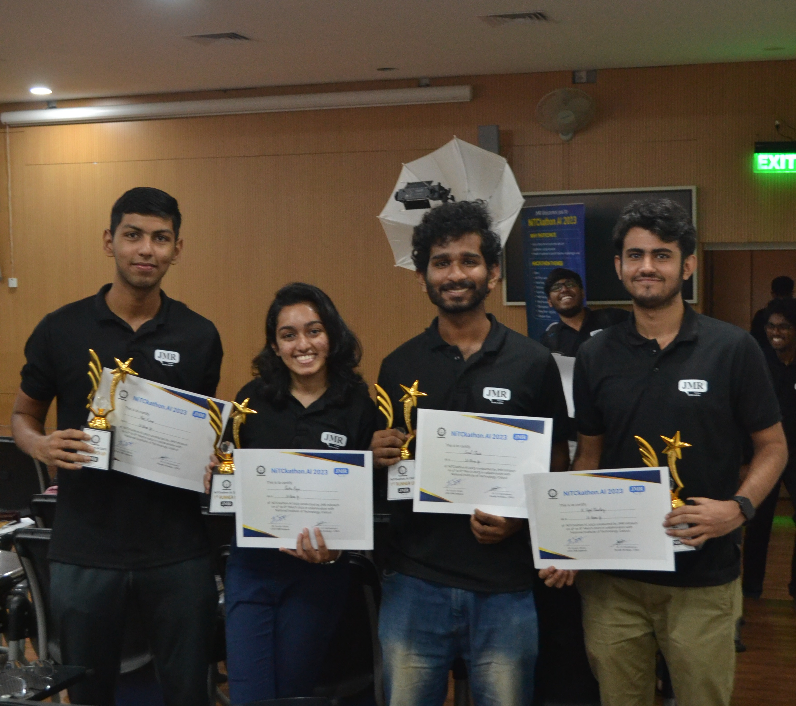

# PCBB: Predicting Consumer Buying Behaviour

This project was developed as a part of NITCkathon.ai organised by JMR InfoTech. The problem statement that we received was to create a predictor for consumer buying behaviour. The goal is to help retail companies make better decisions about their consumers' purchasing patterns. We have developed a web-based platform that allows users to predict the amount a single consumer will spend based on their attributes, or to upload a CSV file for batch predictions. The platform also provides comprehensive graphs based on the dataset, enabling users to visualize key patterns and trends in the data. We hope this tool will be valuable for employees in the retail industry seeking to gain insights into their customers' behaviour and make data-driven decisions.

## Team members
|S.L. No.| Name | Roll number | GitHub ID |
| ----- | -------- | -------- | -------- |
|1|Pavithra Rajan|B190632CS|[@Pavithra-Rajan](https://github.com/Pavithra-Rajan)|
|2|Lenoah Chacko|B190657CS|[@lenoah-chacko](https://github.com/lenoah-chacko)|
|3|K Gopal Choudhary|B190501CS|[@GC6610](https://github.com/GC6610)|
|4|Amit Kumar|B190343CS| [@aktgb31](https://github.com/aktgb31)|

There are two main parts of this project:

- [Website Front-end](https://github.com/LearningRate-0/PCBB-Frontend): This repository contains all the necessary files for the front-end of the application.
- [Consumer buying behaviour predictor](https://github.com/LearningRate-0/Consumer-Behaviour-Predictor): This contains the model we developed. 

This is our [documentation](https://github.com/LearningRate-0/Consumer-Behaviour-Predictor/blob/main/README.md) and [final presentation](Presentation.pdf).

## Update
We won 2nd place!

